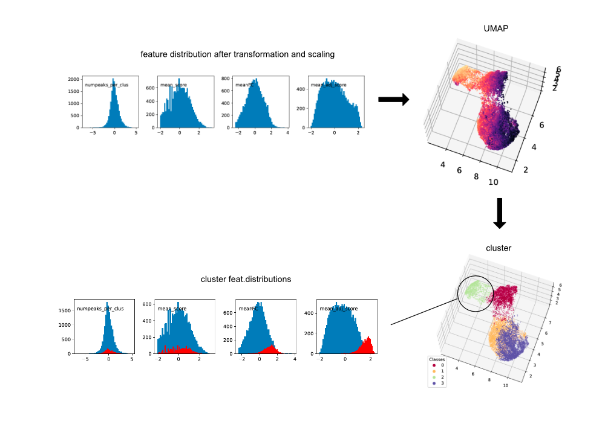

## Description

Characterisation of subgroups of genomic regions based on underlying features.
Background and goal: There are a set of genomic regions which are our 'true positives' in that they show certain features that we know should be shown by true positives. Many of these are missed by traditional peakcalling -> filtering, so what we did here was to call peaks using relaxed thresholds, and now take advantage of the feature distributions (known by us) in order to separate out real peaks from other spurious peaks/noise.

* Features are transformed and scaled using custom transformation functions, and scikit-learn functions.
* Transformed and scaled data are subjected to [UMAP](https://umap-learn.readthedocs.io/).
* The UMAP projection of the data points are then used to define clusters.
* Use the feature distributions to choose the desired cluster, which contains genomic regions of interest.

## Overview

